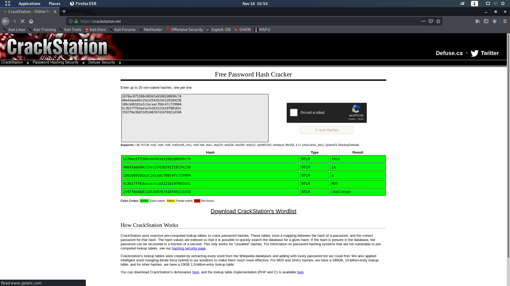

# Write-up

## Prologue 

(Skipped)

## Walk-through

### Install Volatility

Quite a number of participants said that they cannot run hivelist. This is because of missing dependency for volatility plugins. Below I'll show my installation steps for volatility 2.6.1 on Kali.

```bash
sudo apt install build-essential libssl-dev libffi-dev libxml2-dev libxslt1-dev zlib1g-dev python2-dev -y
curl -LO https://bootstrap.pypa.io/get-pip.py
sudo python2 get-pip.py
rm -f https://bootstrap.pypa.io/get-pip.py
python2 -m pip install distorm3==3.4.4 pycryptodome
git clone https://github.com/volatilityfoundation/volatility.git
```

### Reading NTML Hash from RAM

OtterCTF has quite a number of challenges regarding Windows RAM. I see that there are teams taking reference from it. However, `lsadump` will not work here as I didn't set any default password inside Windows.

The command below will try to figure out the OS system based on KPCR and KDBG, which works well on Windows ~~only~~.

```consolde
byronwai@kali:~/volatility$ python2 vol.py -f '/home/byronwai/Downloads/memory.dmp' imageinfo
Volatility Foundation Volatility Framework 2.6.1
          Suggested Profile(s) : Win10x64_17134, Win10x64_14393, Win10x64_10240_17770, Win10x64_10586, Win10x64_18362, Win10x64, Win2016x64_14393, Win10x64_16299, Win10x64_17763, Win10x64_15063 (Instantiated with Win10x64_15063)
                     AS Layer1 : SkipDuplicatesAMD64PagedMemory (Kernel AS)
                     AS Layer2 : WindowsCrashDumpSpace64 (Unnamed AS)
                     AS Layer3 : FileAddressSpace (/home/byronwai/Downloads/memory.dmp)
                      PAE type : No PAE
                           DTB : 0x112335000L
                          KDBG : 0xf803d6389b20L
          Number of Processors : 2
     Image Type (Service Pack) : 0
                KPCR for CPU 0 : 0xfffff803d63e3000L
                KPCR for CPU 1 : 0xffffd001f33a0000L
             KUSER_SHARED_DATA : 0xfffff78000000000L
           Image date and time : 2020-09-15 12:31:18 UTC+0000
     Image local date and time : 2020-09-15 20:31:18 +0800
```

`hivelist` is the plugin for finding registry address.
```console
byronwai@kali:~/volatility$ python2 vol.py -f '/home/byronwai/Downloads/memory.dmp' --profile=Win10x64_15063 hivelist
Volatility Foundation Volatility Framework 2.6.1
Virtual            Physical           Name
------------------ ------------------ ----
0xffffc000bdef9000 0x0000000118bc2000 \??\C:\Users\test\ntuser.dat
0xffffc000be08a000 0x000000011aa0c000 \??\C:\Users\test\AppData\Local\Microsoft\Windows\UsrClass.dat
0xffffc000be10f000 0x000000011cd41000 \??\C:\Windows\AppCompat\Programs\Amcache.hve
0xffffc000be639000 0x0000000120ab9000 \??\C:\Users\test\AppData\Local\Packages\Microsoft.Windows.ShellExperienceHost_cw5n1h2txyewy\Microsoft.Windows.ShellExperienceHost_10.0.10240.16384_neutral_neutral_cw5n1h2txyewy\ActivationStore\ActivationStore.dat
0xffffc000be76a000 0x0000000102a68000 \??\C:\Users\test\AppData\Local\Packages\Microsoft.Windows.ShellExperienceHost_cw5n1h2txyewy\Settings\settings.dat
0xffffc000be868000 0x000000013bb35000 \??\C:\Users\test\AppData\Local\Packages\Microsoft.Windows.Cortana_cw5n1h2txyewy\Microsoft.Windows.Cortana_1.4.8.152_neutral_neutral_cw5n1h2txyewy\ActivationStore\ActivationStore.dat
0xffffc000be8db000 0x000000012a1c9000 \??\C:\Users\test\AppData\Local\Packages\Microsoft.Windows.Cortana_cw5n1h2txyewy\Settings\settings.dat
0xffffc000bea15000 0x000000012af88000 \??\C:\Users\test\AppData\Local\Packages\Microsoft.Windows.Cortana_cw5n1h2txyewy\LocalState\speech_onecorereg.bin
0xffffc000bc628000 0x0000000000928000 [no name]
0xffffc000bc63e000 0x0000000000935000 \REGISTRY\MACHINE\SYSTEM
0xffffc000bc673000 0x0000000000964000 \REGISTRY\MACHINE\HARDWARE
0xffffc000c0dc9000 0x000000010313a000 \Device\HarddiskVolume1\EFI\Microsoft\Boot\BCD
0xffffc000bccb0000 0x000000000fbbb000 \SystemRoot\System32\Config\SOFTWARE
0xffffc000c0857000 0x0000000103660000 \SystemRoot\System32\Config\DEFAULT
0xffffc000c45ee000 0x000000010726b000 \SystemRoot\System32\Config\SECURITY
0xffffc000bd496000 0x000000010bb5f000 \SystemRoot\System32\Config\SAM
0xffffc000bd469000 0x000000010bf5c000 \??\C:\Windows\ServiceProfiles\NetworkService\NTUSER.DAT
0xffffc000c09bb000 0x000000010c999000 \SystemRoot\System32\Config\BBI
0xffffc000bd63e000 0x000000010cf2d000 \??\C:\Windows\ServiceProfiles\LocalService\NTUSER.DAT
```

Dumping hash based on SAM and SYSTEM address, which is obtained in the last command. SAM is the addrivation of Security Account Manager, where it stores the Windows user passwords.
```console
byronwai@kali:~/volatility$ python2 vol.py -f '/home/byronwai/Downloads/memory.dmp' --profile=Win10x64_15063 hashdump -s 0xffffc000bd496000 -y 0xffffc000bc63e000
Volatility Foundation Volatility Framework 2.6.1
Administrator:500:aad3b435b51404eeaad3b435b51404ee:31d6cfe0d16ae931b73c59d7e0c089c0:::
Guest:501:aad3b435b51404eeaad3b435b51404ee:31d6cfe0d16ae931b73c59d7e0c089c0:::
DefaultAccount:503:aad3b435b51404eeaad3b435b51404ee:31d6cfe0d16ae931b73c59d7e0c089c0:::
test:1000:aad3b435b51404eeaad3b435b51404ee:8846f7eaee8fb117ad06bdd830b7586c:::
flag01:1001:aad3b435b51404eeaad3b435b51404ee:1678ac6f5380c60363a91082d0699c74:::
flag02:1002:aad3b435b51404eeaad3b435b51404ee:40e43aee94115e12541624221019423b:::
flag03:1003:aad3b435b51404eeaad3b435b51404ee:186cb09181e2c2ecaac768c47c729904:::
flag04:1004:aad3b435b51404eeaad3b435b51404ee:5c3b27ff63ae1e7e1b3221b19f00183c:::
flag05:1005:aad3b435b51404eeaad3b435b51404ee:1597f8e3b872d5348767416f6921d346:::

```
Go to <https://crackstation.net/> and search for the NTLM hash. `rockyou.txt` cannot recover all the hashes.


## Video
[](http://www.youtube.com/watch?v=k2c4fyVonjk "HKCERT CTF 2020 RAM")

## Flag

Base on the description, subsitite the words into flag format.
`hkcert{this_is_a_MD5_challenge}`

## Epilogue

Solve: 6/81 (Tertiary)
This is an easy chal and I was expecting for more solves. The main reason is there are already too much tutorial for Windows password discovery from memory level.

## Reference
<https://aio-forensics.com/recover-windows-passwords-Forensics>